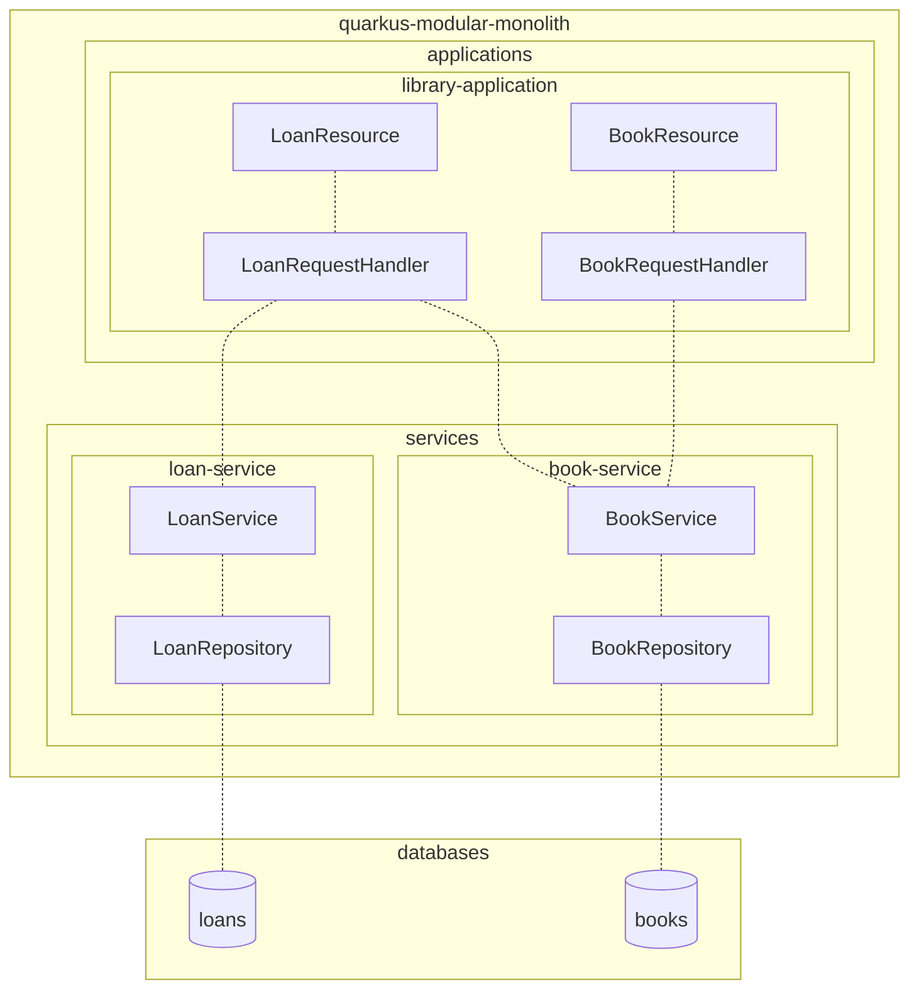

# Quarkus Modular Monolith

A base project for creating modular monolith architecture with Quarkus.

The project is divided into applications and services:

#### applications:

The applications could be backends for several frontend applications

- library-application
    - contains the http endpoints for the application

#### services:

The services can be used by multiple applications.

- book-service
    - BookService and database
- loan-service
    - LoanService and database

In addition there's a module called "quarkus" which is the root module for the project.



### Running the application

To start the application locally, run the following command:
```mvn clean compile quarkus:dev```